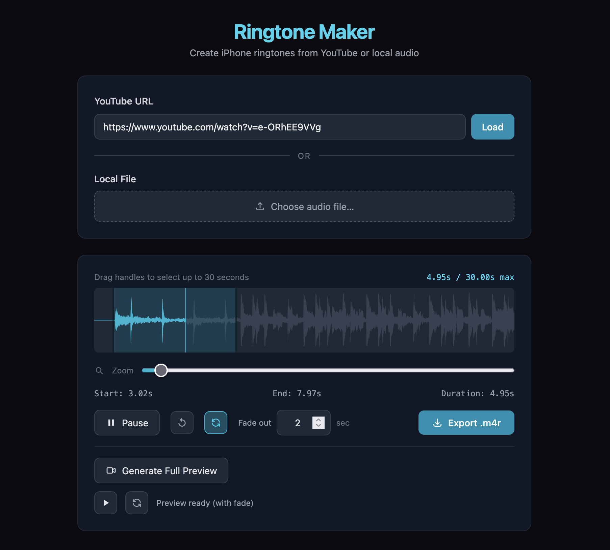

# Ringtone Maker

This is a simple vibe-coded application that wraps yt-dlp and ffmpeg (installed locally) with a web UI to allow users to create simple ringtones.

# Usage
Prerequisites: yt-dlp and ffmpeg installed.

```
npm run dev
```

The app should be running on localhost:3000.



# Tech Stack

- Needs yt-dlp (fetch mp3 or m4a audio) and ffmpeg (trim music and add fade out) installed locally on your Mac
- Uses Express for backend
- Uses vanilla Typescript and WaveSurfer.js to display waveform UI

